## 1.计算机组成与体系结构

### 1.数据的表示

#### 1.进制转换 

1.1其他进制转十进制（注意小数点前第一位是0次方）

 

1.2其他进制转十进制

1.2.1除基取余法，基就是比如二进制，基就是2

1.2..2减法（记住2的前十次方就行，在算ip地址的时候有用）

1.2.3 二进制转八进制和十六进制（以及十六进制和八进制反转二进制）

注意0x000F和000FH等价,都代表十六进制数000(15)

注意点就是 看下面 10001110转换为八进制就是216，一个八进制代表三位2进制，一个十六进制代表四位二进制

#### 2.原反补码

**计算机中的计算都是运用补码计算的，没有负数，所以符号位用1代替负号**

**移码就是补码的符号位取反，其他位不变，记住就行**

如下图可以看出 用数值1的原码加上数值-1的原码 为 00000001 加上 10000001 值为10000010 换算一下为-2 不准确

用反码计算 00000001加上11111110 值为11111111 换算为十进制也不对

但是用数值1和数值-1的补码计算 00000001 加上11111111 为100000000 换，**但是计算机固定取后八位字长**，前面那位1被省略了，所以值为00000000，换算十进制为+0 是准确的 所以可以看出用补码计算最准确

2.2原反补移的取值范围和可取个数

2.2.1原码的取值范围（反码和原码是一样的）

举例当n=3，也就是有三位的时候，分别有000,001,010,011,第一位算作符号位时，代表-0，-1，-2，-3也就是-0~-3；以及100，101，110，111，第一位也是第一位做符号位，代表+0,+1,+2,+3,也就是+0~+3,然后算能取值的范围就是去除符号位的绝对值也就是11最大，不好算就用二进制的11+1也就是二进制的100，也就是2的2次方，然后减去刚刚加上的1，也就是2的2次方-1，然后带上符号位，取值范围就是负2的2次方-1到正2的2次方-1，由于n是3，所以取值范围就如下;

而数码的个数如n=3时为2x2x2=8，**而+0和-0其实是一样的-0是没有意义的**(这里按照这么理解就行)，所以减去，个数为8-1=7个

2.2.2补码和移码取值范围和可取个数(**补码这里常考，不算很懂**)

还是以n=3举例，移码和补码通过**人为规定**将负0（因为n=3所以是100）也就是100扩大最小值取值范围变为负2的二次方(**这里是认为规定最前面那位1即做符号位又做数值位,本质也就是1100，化为十进制为-4**)，所以取值范围的最小值不需要像原码和反码一样-1，为-2的n次方，，而正数最大值还是3没变所以还是二的n次方-1,最大值到最小值范围即是负2的n次方~正2的n次方-1，而数码个数由于多了-0，所以不需要减去一，为2的n次方

总结:**人为规定的补码和移码中-0的符号位也算数值位，比如100，实际就是负2的2次方，也就是-0的补码当作负数最大值x`十进制的-128；在原码和反码中不要-0**

2.2.3定点小数，也就是没有整数位的原反补移的取值范围

假如n=3，原码和补码，那么定点小数第一位为符号位，然后紧跟一个小数点，然后跟后两位，也就是最大为0.11,我们还是可以加上0.01，结果为1.00，也就是1，然后0.01为2的-2次方，用1-2的-2次方的正负值就是定点小数的取值区间**；补码和移码还是由于有一个-0的存在，-0也就是1.00，由人为规定最前方这个1既作为符号位也作为数值位也就是-1为定点小数的最小值，因为哪怕是没有认为规定的最小值0.11转换为十进制也是负的1-2的负n-1次方，还是比-1要大，**数码的个数和定点整数一致

例题1

例题2

注意 这里的2X是2*X，可以理解成数学里面 方程里面的2x 就是2乘X，在计算机中H是十六进制的标识，B是2进制的表示，没有特殊标识，就是十进制。90H转换为二进制就是10010000 补码-1就是反码，为10001111，在转换为原码，为11110000，第一位是符号位，所以可以理解为-01110000，换算成二进制为-116，2乘X等于-116,X等于-56

#### 3.浮点数的表示

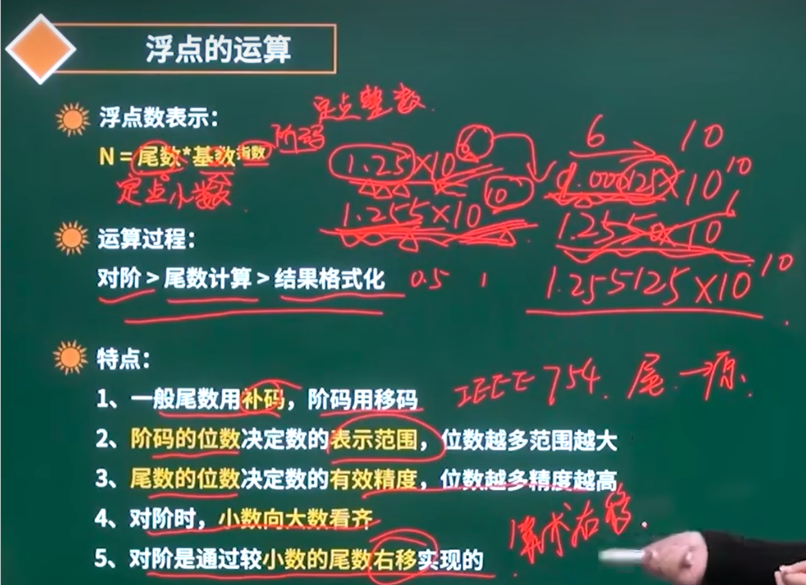

浮点计算例题1

解题思路，首先按照下图写出十六位的数，顺序是阶符-阶码-数符-尾数，求取值范围，所以就是用正负最大绝对值即可算出

首先算出阶码和阶符的最大最小值，阶符为0，阶码为111111为最大，组合起来为0111111，加1为2的六次方也就是64，再减去加的1为63，我们需要记住一点，阶码最小值是认为规定的-0，也就是阶符为1，阶码为000000，组合为1000000，符号位也作为数值位，所以最小值为-2的六次方，为-64，所以阶码的范围为-64~63；然后看数符加尾数，浮点数可以看成定点小数，所以组合起来最大值为0.11111111,加上0.00000001等于1，0.00000001为2的负8次方，所以尾数加数符最大值为1-2的负八次方，最小值一样的不需要思考，由于用补码表示，所以最小值就是1.00000000，认为规定符号位也作为数值位置，所以最小值为-1；结合起来 该浮点数可表达范围是-1乘2的负64次方~1-2的负八次方乘2的六十三次方,通过最大值阶码为63排除A和C，然后B和D的最大值相同，比较最小值，最小值那个更小，表示的范围更大，可以看出B举例零的左侧更小，范围更大，且在刚刚计算的这个浮点数表示范围内，选B,(**注意一下，-1x2^63才是整体最小值,而不是-1x2^-64**)

#### 4.逻辑运算

关系运算符

数据的表示 逻辑运算（知道就行）

逻辑运算符（大概知道就行）

看一下下面例子运算即可(可以看看，帮忙理解，计算机里面没有true，false，只有0代表false，1代表true)

**真题训练**

a的低四位假设为0000，和0x000F比较实际上就是和F比较，F就是1111，选项a，0000和1111逻辑与运算结果为0000，运算结果为0，所以选a，；看b选择，举个反例就行 加入a后四位是0111和F也就是1111逻辑或运算，结果是1111，也是F，所以错了，其他选项一样举反例

### 2.校验码（常考）

#### 1.奇偶校验（0个1也是偶数个1）

**说人话就是信息位加校验位的1的总数，为奇数如果是奇校验就校验成功**

举例  如果有一个二进制1代表男，那么信息位就是1，如果是奇校验我们可以在信息位后面加上一个0，不能加1，加了1不就直接成偶数个1了，所以结果为10，当计算机检查到数据为00或者11的时候，就能检测到这个地方有误；

偶校验 ，如果信息位是1，我们加上校验位1，不能加0和上面同理，组成11，那么当我们收到数据为01，或者10的时候会报错，因为是奇数个1，所以可以检测到错误，但是当收到的数据是00呢检测不到错误，因为0个1也是偶数个1，所以奇偶校验有局限性。

例题

A选项，按照我的理解，所有奇数位置出错，举个例子  真正的数据是101，前三位是信息位，第四位是校验位可以是1011，如果获取到的错误数据是0001，奇数为都错了，但是还是符合奇校验，所以错误；

B选项，101为数据，所以正确的偶奇验是1011，但是当我的数据是1110的时候，一样是所有偶数出错了，但是校验不出错误所在；

c选项是对的，奇数个数据位出错，说明符号位是对的，数据为101，正确奇校验是1011，当信息位也就是前三位有一个或者三个错误时候，0011，1001，0101可以看出错了；

D选项，偶数个数据位出错是看不出来的，可以理解为负负得正，原数据为101，正确奇校验为1011，就举个反例，0111，第一位和第三位数据位都出错了，那么刚好如果原本是01变成了10，还是奇数个1，如果原本是00变为11还是偶数个1，这样根本无法判断出哪一位错了

#### 2.循环校验码CRC(可检错，不可纠错)

#### 3.海明码（重点，也叫汉明码）

**公式2的r次方>=m+r+1**,r代表海明码的个数，m代表所有传递的信息码的个数，要满足黑板列出的公式，例如我们要传的信息码值个数是16，海明码r=4时，不符合，所以r=5最符合，2的n次方就是海明码在数据中存放的每一个位置，此处r=5所以位置在2的0次方，2的一次方一直到2的五次方五个位置

三种校验码总结

例题

看第二题D5在题中位置是10，海明码必须在2的n次方位置上，10等于8+2，第八位是p4，第二位是p2，所以在P4P2等于2的上面，也可以换成二进制为1010,快速定位到海明码位置

###  3.cpu组成

### 4.寻址方式

### 5.CISC（C代表complex：复杂）和RISC（R代表reduce：精简）

**还算常考，需要通过描述知道是那种指令**

### 6.流水线（重点）

**（上午考一到两分，下面图示的1是一条流水线，2是一条，不是1到2到3是一条，别搞错了）**

例题

理论公式（一条指令执行时间）+（执行指令条数-1）x流水线周期；

当理论公式不在正确选项里就用实际公式计算，流水线划分段数x流水线周期+（执行指令条数-1）x流水线周期，**流水线周期是一段指令中执行最长的那个时间**

使用串行方式就是顺序执行，全部执行完（3+2+4）t*10=90t；流水线周期就是一条指令中取指，分析，执行中用时最长的时间（这里的三段只是举例，别的流水线可能有四段，五段），此处是4t；十条指令执行完理论公式（3+2+4）+（10-1）*t*4=45t；实践公式：k为3，因为分三段，然后算出来是48t

公式原理

理论公式要记住，第一条指令的第一步执行完才能开始第二条指令的第一步，**第一条指令的任何一步都要在第二条指令之前，看上图的第一条指令的第三步没执行完，第二条指令的第二步执行完了，那么第二条指令的第三步要等第一条指令的第三步执行完才能开始**

实践公式本质就是每一个步骤都取流水线周期，也就是最长的步骤

吞吐率=10/45t

最大吞吐率记公式就行，t就是流水线周期，所以这里等于1/4t

### 7.存储系统（一般考1-2分）

#### 1.层次化存储结构

层次化存储结构-分类

#### 2.Cache

概念

此处的例子是 如果访问一百次数据，90%cache访问命中率，那么按照上述公式，cache的周期为1ms，访问主存储器周期是100ms，那么

（90x1ms+10x100ms）/100就是平均访问周期=10.9ms 比光用主存储器快很多，考的不多，主要这个计算思路

cache-映像（三种映像记住下面总结即可）

下面的原理了解即可，什么叫冲突，当cache的第0页有数据了，主存其他区的第0页放进去就是冲突，下面的例子就是如果cache的0-14也都有数据，那么出现冲突的概率就是2048-15-128  不冲突就是128    2048就是主存的总页数，15就是主存已经放进去的页数，不冲突就是cache的第十五页没有放数据，在主存中有128个第15页可以放进去

全相联映像就是主存的每一页都可以放在cache的任意页

组相联映像

映像总结

#### 3.主存-编址与计算

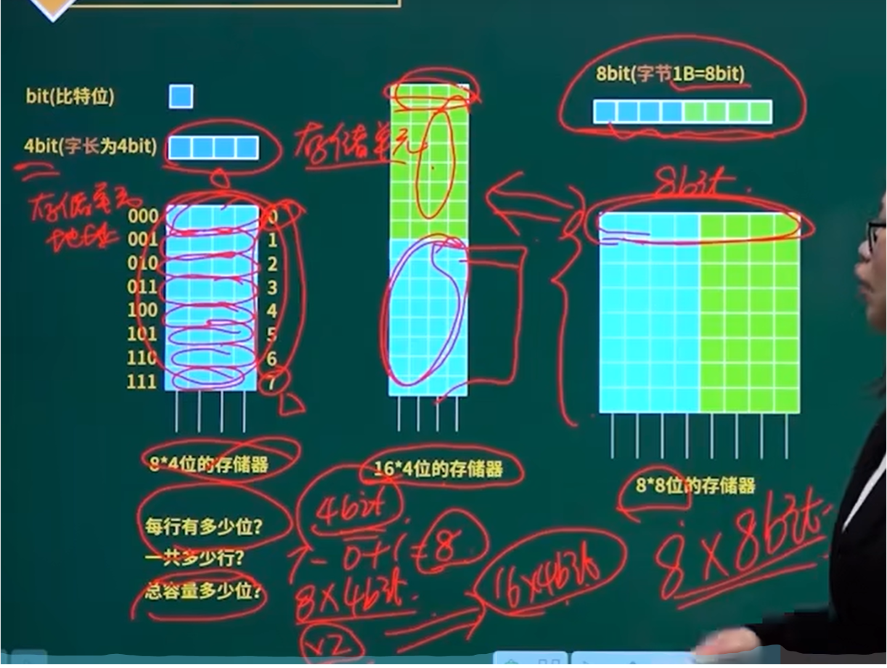

例题讲解

1字节就是1b=8bit（比特），10000H到CFFFFH的内存的存储单元等于CFFFFH-10000H+1=30000H=3X16的四次方x8bit，换算为kB单位，（3X16的四次方x8bit）/8bit/2的十次方=3x2的六次方=192kb，至少需要3片，就是192kb/（64kx8bit），b=8bit，所以结果为3

8.输入输出技术（重点程序中断方式）

 数据传输控制方式

### 9.总线（考的不多）

### 10.可靠性（考的话就是1-2分）

串联系统与并联系统（是可靠性里面的内容）

R1,R2,R3这些就是可靠率，是一个百分比，不可靠率就是1-可靠率

所以下面串联的可靠率=R1XR2XR3....

并联可靠率就是1-所有不可考虑=1-（1-R1)X(1-R2)X(1-R3)

N模混合系统（混合串联和并联）

例题（这个选项a曾经反复考到过，没有可靠来源，死记硬背就行）

这题选c

### 11.性能指标（不常考，考到就是1-3分）

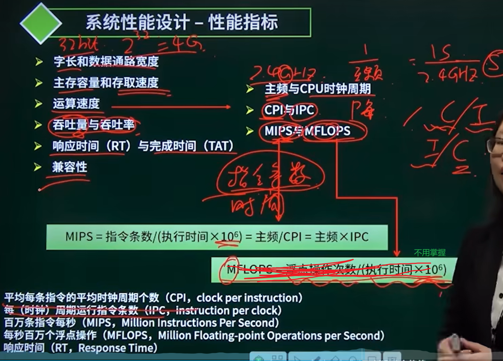

例题

**这里知道的是ipc，每时钟周期运行执行条数其实就是执行时间，计算百万条指令每秒需要在cpi也就是执行时间上加一个m的单位，因为cpi是一条指令的平均执行周期，百万条指令当然需要加百万也就是m这个单位**

### 12.章节总结和分值分布

平均每次考试75分中考6分

## 2.操作系统

主要都是概念

### pv操作（多写几个例题理解，必考）

互斥模型

信号量就是打印机数量，因为打印机同时只能一个进程使用

#### 进程管理-pv操作与同步模型

参考系不同，当一个市场只能容纳一个产品所以初始值为1，，当生产一个产品，送到市场，市场满了，所以是p操作-1 此时缓冲区为0不能再生产产品，然后消费者从市场拿走那一个产品，v操作+1，缓冲区由0+1变为1，市场又可以再放一个产品；

而当以产品为参考，初始值为0，产品送到市场就是v操作+1；当消费者取走产品就是p操作-1；

互斥与同步模型结合

单缓冲区，所以s1=1，也就是市场存在一个缓冲区，s=1的意思是，当你执行的是先生产一个产品，然后消费产品这个进程；就不能再同时使用送产品到缓冲区，然后从缓冲区取产品这个进程了，这个s=1我感觉就是m，但是不能确定

例题

由题可以看出temp其实就是缓冲区，当用户找到单元Tj买票时，如果另外一个用户也来买，是不是就有冲突了，所以这是典型的互斥模型，所以a地方应该是p（s）操作，当temp大于等于x，也就是大于用户购票数量时让Tj等于原来Tj-用户购票数，也就是剩余票数；然后我们要释放内存，V（s），这样就可以让下一个用户再来购票；当temp小于x的时候也是一样的，需要V（s），由此可以看出 s信号量取值应该为1，因为这个值本质就是互斥信号量，为了控制这个当前终端只有一个人在进行购票操作

#### 前驱图和pv操作图结合考察

**注意啊，p和v括号里面的操作都是针对于键线，而不是进程**

上面的图看的懂，后继进程需要检查前驱操作是否完成，所以就是p操作，前驱需要通知后继何时开始运转，所以是v操作，信号量针对的不是你有多少个进程，而是针对的你有多少条键线，四条健线所以四个信号量，键线的箭头处是p操作，键线的末尾是v操作。

后面听懂的 ，下面半张图的意思是比如Pa执行就是A线程执行，在A线程执行前没有前驱，在A线程执行完之后有个后继，所以当A线程执行完毕后，V(Sa),其他两个同理，再看D进程那个图，首先D进程执行前存在三个前驱，所以需要分别三个P进行完后，D线程才会执行，当D线程执行完后，前驱图中D线程还存在后继，所以要进行V(Sd)操作释放内存，然后到E线程，存在一个前驱，所以要P(Sd)，没有后继

例题

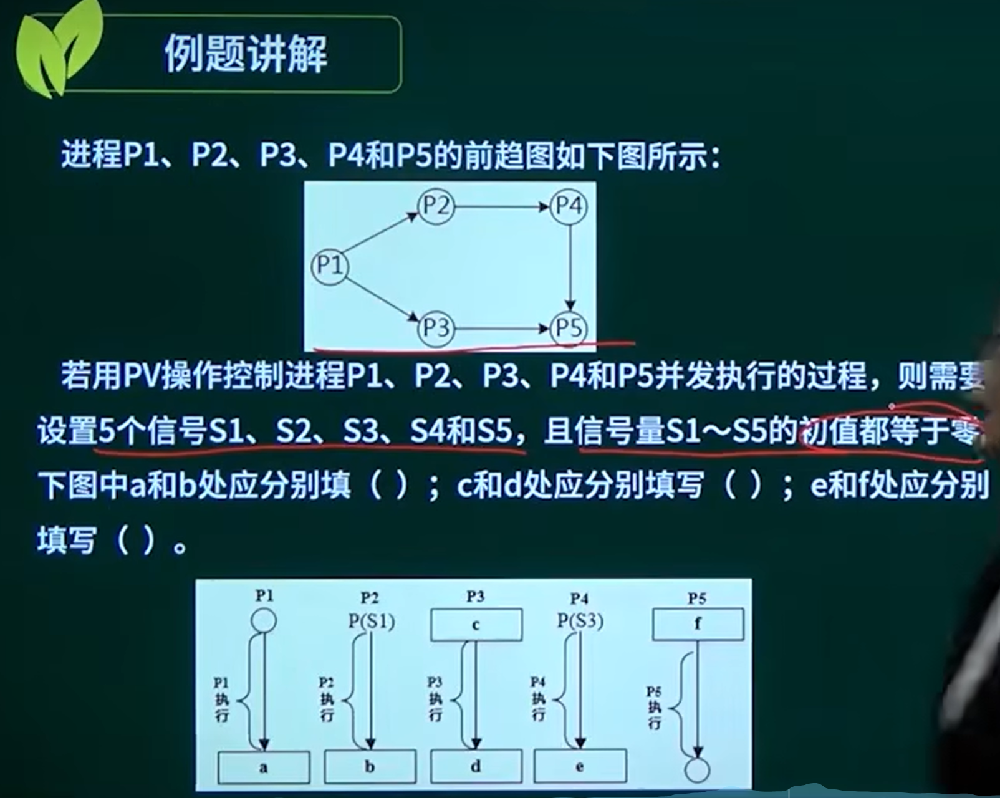

结果是C，B,B,首先知道s1-s5是那五条键线，，然后看a空，p1执行后，a就是v操作，看看四个选项中存在v操作的是A和C，且p1存在两个v操作，所以结果为C选项，且我们知道了p2的前驱是p(s1)，所以通过选项我们能知道p1到p3的键线是s2；通过p4是的前驱是p(s3)，所以我们知道p2和p4之间的信号量是s3，所以b空是v(s3)

然后看c空，p3的前驱是p(s2)，p3执行后的d空可以看出是有一个后继，所以是一个v操作，然后排除后由选项可以知道p3到p4之间是s4，所以是d空是v(s4)；

e空和f空一样

#### 进程死锁资源数计算

由下图可以看出，当资源数小于4个一定死锁，当资源数等于4个可能死锁，可能不死锁，当资源数等于3x5=15的时候也是可能死锁，可能不死锁，一旦资源数大于15，等于16时一定有一个进程可以完成运行，并释放资源给其他进程；**下面公式中w是每个进程需要资源数；m是进程数；n就是资源数，达成这个条件n>=16,进程一定不会死锁，注意求的是死锁还是不死锁**

根据下

**进程资源图**

先处理分配，然后处理申请

例题

首先分配，两个r1分别分配给p1和p3；三个r2分配给p2一个，p3一个还剩一个r2；全部分配看完再看请求，p1向r2申请一个资源，然后r2没有可分配资源了，再然后p2向r1申请资源，r1没有资源，所以p2是阻塞节点，p3同理，**这里可以看出考虑是否为阻塞节点是不考虑资源释放的**，然后是否可化简的意思是，p1执行完后释放一个r1，由于p1释放了一个r1，所以p2可执行，然后释放一个r2，然后p3可执行，全部可执行的都可以化简掉，最后啥都不剩，所以当前进程资源图可化简，非死锁，死锁就是资源图最后无法全部化简。

断页式存储

页式存储（常考）

物理地址就是用页表里面页码对应的页帧号替换逻辑地址中的页号

下图中的逻辑地址是10110011011110 后十二位是页内地址，前两位是页号，为2，2代表的页帧号是6，所以物理地址是110110011011110

**总容量等于存储个数x偏址内容（默认题干没有声明情况下，偏址内容是1B，也就是1字节）**

**下面这个4kb 是2的12次方b，4k明明是十三位啊，4kb=4096，这是因为4096代表的地址为0-4095这4096个地址，4095就是十二位的1，没有到第十三位，所以这一页大小最大为十二个1 也就是0到二进制的十二个1**

断页存储淘汰的是在内存中的，淘汰依据优先考虑访问位为0，也就是最近没有被访问过的（就近时间原理）；然后考虑修改位为0

例题

物理页大小是1kb，代表的是0-1023也就是0到2的10十次方-1，是十位，，1023是1111111111，所以是逻辑地址的后十位，逻辑地址1024等于2的十次方是十三位 1000000000000 ，这里一定注意，所以 后十二位为页内地址，第一位1是逻辑页，对应的物理页是3，

然后第二空这个假设就是结果，就是很奇妙的送分给你，具体如何共享物理页我们不需要知道

段式存储（考的不多）

合法段的判断根据段长，如果断肠是30k，你的偏移量是（0,25k）那么偏移量是合法的，如果偏移量是(0,35K)大于了30k的段长，那就非法了，只有合法的逻辑地址可以转换为物理地址

基址就是内存存储的起始地址，逻辑地址是：（段号，段内偏移量）

例题

可以看出 前面是段号，段号对应的偏移量，只有B选项全部符合

#### 磁盘管理（较常考）

磁道号就是柱面号，磁盘的计算只用看磁道或者柱面号

例题

##### 先来先服务算法

根据访问顺序依次移动磁道

##### 最短寻道时间优先算法

离90前后有58和160号磁道，由于58更近，所以就依次向外，最后到了18以后没有向外最近的磁道就向内找，找到最近是150，依次进行

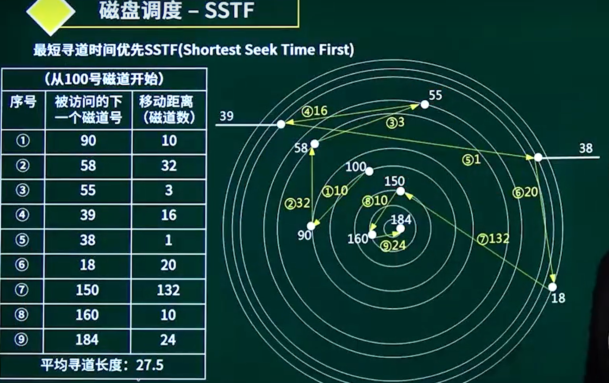

例题1

有难度，正常题目是没有这个图示的，这题其实考的是流水线，当数据读入缓冲区到缓冲区将数据送至用户区时，单缓冲区是只能等待的，只能等到这两步完成后才能开始下一次，但是工作区处理数据是可以同时进行的，就是可以在工作区处理数据时候开始下一次读入缓冲区操作，这其实就是一个分为两段的流水线，前面两部分的15us和5us是一部分，后面处理数据的1us是一部分；

双缓冲区的时候如下图示例可知，就是说当你第一次读入缓冲区，缓冲区送至用户区这一步可以同时并行处理了，也就是流水线被分成了三段，按照这三段流水线进行计算；

例题2

同一个柱面不用区分扇区或者磁头号

例题3（很巧妙）

一个磁道11个物理块，旋转周期位33ms，所以处理一个块是33/11=3ms，先要知道，磁头需要将整个R0走完以后才能读取在缓冲区读取R0的数据，当花3ms走完R0开始读取数据，读取数据花费3ms，要知道这3ms柱头不会停止旋转，所以当R0处理完，实际柱头已经到了R2的起点，所以还要转30ms才能开始读取R1，所以读取R0的时间是3ms+3ms，而R1的时间是30ms+3ms+3ms，后面一直到R10同理，这样算出来最长时间6+36x10=366ms；而最优分布的意思就是，因为物理块的位置可以任意摆放，所以看第二张图右侧这个摆放位置，当R0读取完开始且处理完后，刚好到原先R2开始的位置放置R1，这样磁盘又会刚好读取R1，一直这么间隔放，刚好两圈可以读完真个磁盘，最少时间就是66ms

#### I/O管理软件（考一分）

知道这个分层就行

#### 文件管理（考的较频繁）

##### 文件概念（考的很散）

系统将目录文件修改的结果写回磁盘时发生崩溃，对系统影响较大。

##### 树形目录结构（常考）

绝对路径是从盘符斜杠/开始的，好比寄快递，要从国家开始填，相对路径就是送外卖，不需要从国家开始，从你所在城市开始，你填你是什么小区就行，且不需要/，示例如下

#### 索引文件

**考察形式：逻辑页号，使用索引方式，访问磁盘次数，访问磁盘次数（直接索引一次，一级两次，二级三次，以此类推）；最大文件长度**

一整个索引节点上其实就是多个地址项，每个地址项指向磁盘数据块，**下面可知一个地址项4B，一个磁盘索引块1KB，所以1KB/4B=256，也就是一个磁盘索引块可以装256个地址项，磁盘数据块大小也是1KB**由于地址项是由0开始，所以就是第0到第255块地址项，也就是一级索引块里面装有256个地址项，然后致谢地址项指向的就是真正的磁盘数据块的位置；二级间接索引就是比如下图的4里面的地址项指向的是一个装满256个地址项的磁盘索引块（可以叫2级索引块），然后这256个地址项的每一个地址项又分别指向装满了256个地址项的磁盘索引块（1级），然后这256个地址项才分别指向真正的存放磁盘数据块的地方，要注意 如图，这里所有真正的磁盘数据块根据索引是有顺序的排列的

例题

#### 作业管理(了解即可)

#### 章节汇总

#### 考试频率

## 3.程序设计语言与语言处理程序基础

### 程序设计语言概述

#### 1.编译程序与解释程序

#### 2.多种程序语言的特点(仅了解)

#### 3.程序设计语言基本组成成分(常考)

#### 4.函数调用方式(常考)

传递方式的例子

例题

### 编译程序基本原理

#### 1.编译过程概述

##### 词法分析

##### 语法分析

##### 语义分析

语法指导翻译是一种静态语义分析

#### 2.文法(很抽象，很多东西没听懂)

大多数程序设计语言的语法规则用**上下文无关文法**描述

##### 语法推导树(看这个例题就懂了)

语法推导树可能有多个，最终目的就是组合成一个我们想要的结果

例题2(要掌握)

难度有点大，主要用排除法做，考试不会考这么难的表达式

#### 3.正规式与正规集

例子

#### 4.有限自动机

反向的3，就是那木他，代表的是无需识别，就是他中间经过的过程当作空

例题

#### 5.后缀表达式

优先级，注意计算顺序

这里计算都是和栈有关，先进后出，后进先出

这个真题没看懂

#### 6.总结及分值分布

## 4.数据库系统

### 1.数据库的基本概念

#### 1.数据库体系结构

分布式数据库特点

例题

2.三级模式的结构

例题

3.数据仓库（不常考）

**OLAP:联机分析，是数据仓库的特点，注重于分析，预测；OLTP：联机事务，是我们数据库的特点，侧重于数据增加删改查**

### 2.数据库设计（暂时没看完，这是大题主要）

### 4.3E-R图

概念设计阶段

一个班级一般有一个班长，一个班长一般对应一个班级，所以是一对一；一个班级一般有多个学员，所以是一对多，多个学员在一个班级，所以是多对一；而课程和学员之间，因为存在多个课程和多个学员，互相会存在选择，所以互相都是多对多

多个实体间的联系

实体集内的二元联系

实体的分类

### 4.4逻辑结构设计

4.4.1关系模式的相关概念

**数据模型的三要素**：数据结构，数据操作，数据的约束条件

**候选键**：唯一标识元组，且无冗余，可以有一个，可以有多个，可以是单个属性或多个属性的集合；比如对于一个学生来说，学生的身份证号或者学号都可以代表一个学生，所以学号和身份证号都是学生的候选键，我们只能选一个进行标识，而对于成绩来说，用单个属性无法标识，需要用学号，课程号，才能代表一个学生某一科的成绩，所以这里是属性集合。

**主键**：就是从候选键中选出一个来作为这个属性的唯一标识

**外键:对于学生来说学号是主键，对于一门课程来说,假如课程号是主键，我们想要监理学生表和课程表的联系，就可以把课程表的主键课程号写入学生表中，所以对于学生表来说，课程号就是外键**

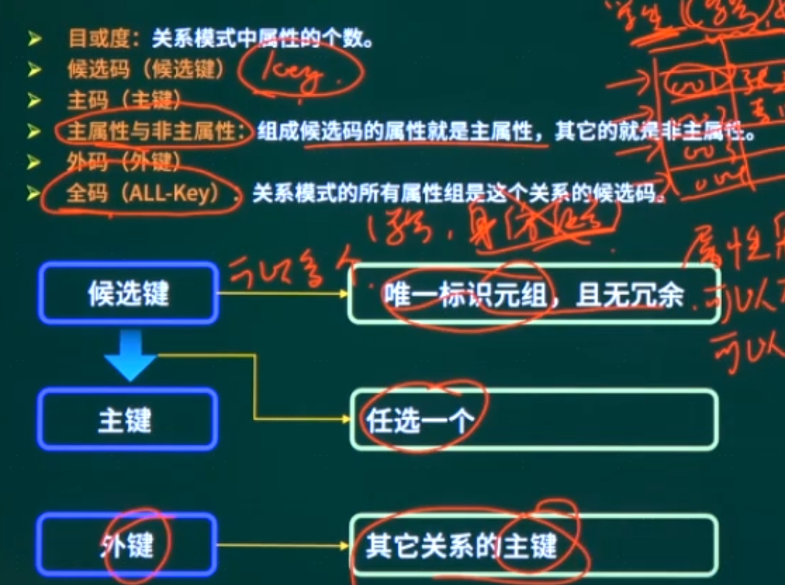

#### 3.4.2E-R模型转关系模式(大题小题都会考)

一对一联系转换

一对多转换

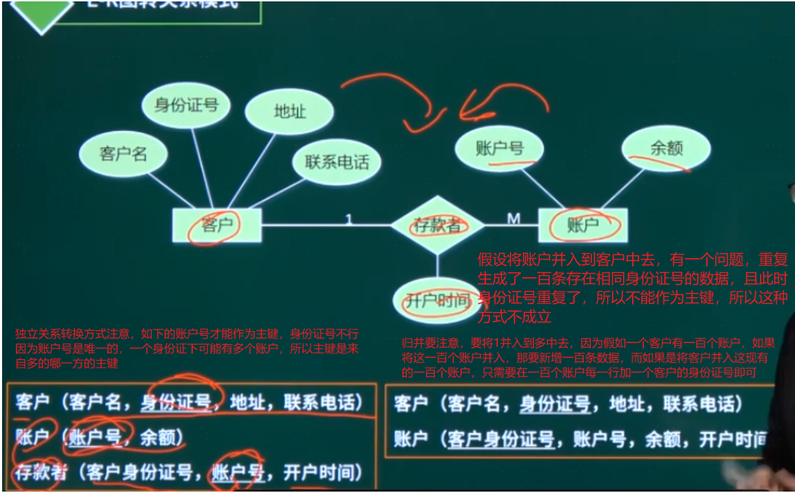

多对多转换**（主键是多端主键的集合）**

### 4.5关系代数(考的多)

**笛卡尔积就是s1和s2的每一行进行排列组合，且每一列可以按照顺序1，2，3，4，5，6标识；**

**投影就是取指定的那几列**

**选择就是取指定的行**

**s1.1=s2.1就是s1的Sno等于s2的Sno；1=2就是第一列等于第二列；1='1'就是第一列等于1**

#### 自然连接

**自然选择除s1和s2相同的列，然后元组行是同列名的相同属性值哪一行，也等于先选择的笛卡尔积，再投影，不等于先投影的笛卡尔积再选择**

再sql语句中select代表的其实就是投影；from代表的就是笛卡尔积，where代表的就是选择

这个式子的计算是，先列出下面s1和s2的笛卡尔积，然后选择第一列和第四列相等的哪一行，然后投影1，2，3，5这四列，结构和自然选择相同

先筛选再进行笛卡尔积，性能更优，因为笛卡尔积是一个乘法，两侧的数据越少，算出来数据越少

例题

例题2

### 4.6规范化理论（必考）

#### 3.6.1规范化理论基本概念(上午常考)

函数依赖

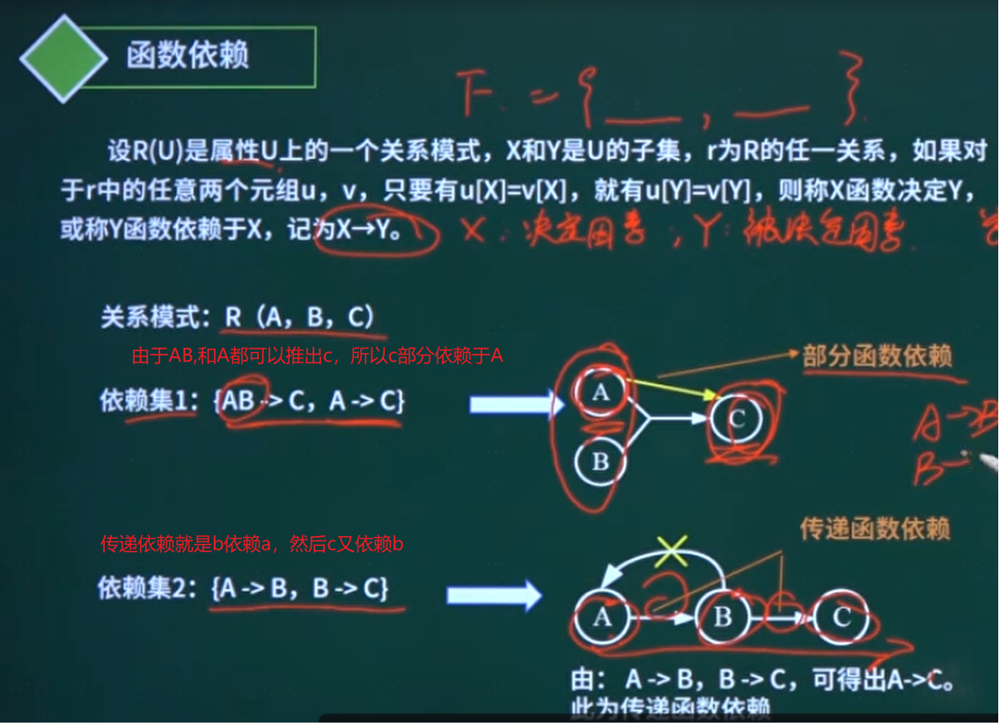

公式需要大概记忆，会考选择题

自反律：如y=B集合，x=BC集合；U=ABC集合，BC可以决定B，所以x决定y成立；其他公式也按照这种集合推理

候选键

做题思路

例题

主属性

**这一题三个属性都是主属性，因为通过(ST,CITY)可以推出ZIP,（ST,ZIP）也可以，先用ZIP推出CITY，然后CITY和ST联合推出ZIP，候选关键字是(ST,CITY)（ST,ZIP)这两个**

例题

#### 3.6.2范式判断(必考，重点)

**范式判断核心首先找到候选键，其次找非主属性，然后改变关系模式，让他们符合范式**

第一范式

第二范式

第三范式

BC范式(只需掌握判断过程，拆分过程不需掌握)

总结

例题

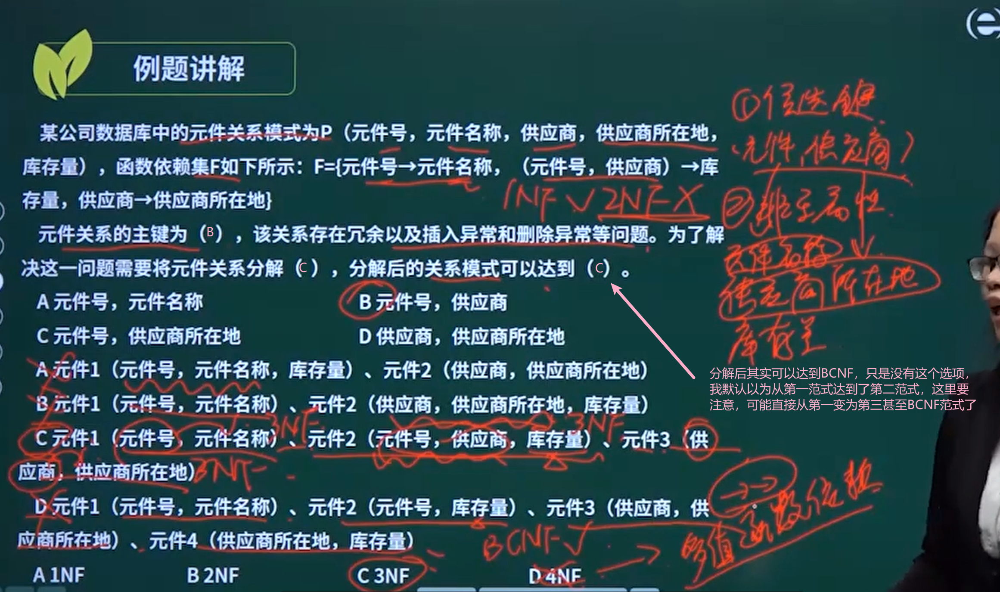

#### 3.6.3模式分解  

**保持函数依赖分解**

**这里我刚开始理解错了R1(ABCE)中，不是A就代表A->BC这个函数依赖，而是R1中存在的属性就代表函数依赖在，因为R1(ABCE)中ABC都存在，所以A->BC,且BCE都存在所以依赖BC->E也存在，其他同理，不要理解错了**

例题

**公式法(简单，但是超过两个关系模式不能用)**

例题

#### 3.7SQL语言

##### 3.7.1普通查询

例题

##### 3.7.2分组查询

GROUP一定和HAVING联用

COUNT是否 使用**DISTINCT**的作用是是否区分行，比如找出两个不同名字的人，但是一个表里 有一个人干了两件事，一个人干了一件事，如果按照事情找，就会找到三个，区分的话就能找到一个人干了两件事，就是两个人

例题

##### 3.7.3权限控制(考不多)

#### 3.8并发控制

1.事务的特性

2.并发控制（基本不考）

3.封锁协议

例题

#### 3.9总结

上午题考察

## 5.面向对象

将大象装进冰箱

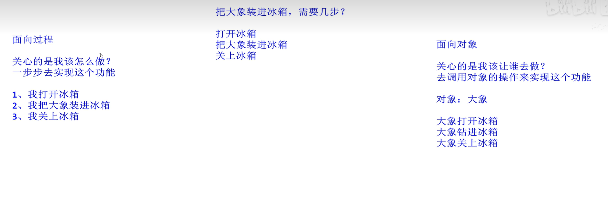

### 面向对象的基本概念

面向对象 = 对象（Object）+ 分类（Classification）+ 继承（Inheritance）+通过消息的通信

#### 类

- 实体类：是应用领域中的核心类。实体类的对象表示现实世界中的真实的实体。
- 接口类（边界类）：的对象为用户提供一种与系统合作交互的方式，是系统内对象和系统外参与者的联系媒介
- 控制类：控制类的对象用来控制活动流，充当协调者

真题1

真题2

真题3

真题4

#### 对象和消息

真题1

真题2

真题3

真题4

#### 重载

## 第一个大题

问题4的总结

## 第二个大题（如果有多个答案，采取相对最合理的）

### 实体

属性

多个实体间的联系

### 小题1的例题

如果有一边是1对1，另外一边没有明确的知道是不是多，那就默认互相是1对1

这里我想错了

问题2

关系模式

关系模式转换

一对一（简单）

一对多

### 多对多

### 三个实体

共用一个关系，就采用多对多的，把所有实体的主键放到关系中，这三个主键的属性组是这个联系的主键

实体和子实体的转换

例题1

**这个例题里面由很多技巧性思路可以学习**

例题2

例题3

## 5.面向对象

### 5.1面向对象基本概念

真题1

真题2

真题3

真题4

### 5.2对象和消息

真题1

真题2

真题3

真题4

### 5.3方法重载

真题1

真题2

### 5.4封装

上图声明的类的调用

真题1

真题2

真题3

真题4

### 5.5继承

**继承是父类和子类之间共享属性和方法的机制。**

继承关系中的子类将全部拥有父类的全部属性和方法，但只能用非私有化的属性和方法

- 子类可以继承父类属性和方法
- 子类可以有自己特殊的属性和方法
- **子类可以重写父类属性和方法**  

java中的使用

这是父类中的sleep方法

真题1

真题2

真题3

真题4

### 5.6多态

在Java中，父类调用子类的相同名称的方法，编译看左边，运行看右边

真题1

真题2

真题3

真题4

真题6

### 5.7静态绑定和动态绑定

编译是静态绑定，运行是动态绑定

真题1

真题2

真题3

### 5.8面向对象设计原则

记忆大致，都是考选择题

真题1

真题2

真题3

真题4

真题5

### 5.9面向对象分析

记大概步骤

1. 认定对象
2. 组织对象
3. 描述对象间的相互作用
4. 确定对象的操作
5. 定义对象的内部信息。

### 5.10面向对象设计

### 5.11面向对象程序设计

### 5.12.面向对象测试

面向对象测试是根据规范说明来验证系统设计的正确性。

1. 算法层：测试类中定义的每个方法，基本上相当于传统软件测试中的单元测试。
2. 类层：测试封装在同一个类中的所有方法与属性之间的相互作用。在面向对象软件中类是基本模块，因此可以认为这是面向对象测试中所特有的模块测试。
3. 模板层：测试一组协同工作的类之间的相互作用，大体上相当于传统软件测试中的集成测试，但是也有面向对象软件的特点（例如，对象之间通过发送消息相互作用）。
4. 系统层：把各个子系统组装成完整的面向对象软件系统，在组装过程中同时进行测试。

真题1

真题2

真题3

真题4

真题5

真题6

真题7 

真题8

真题9

### 杂题

真题1

静态成员可以理解为全局变量，所以实例化对象共享这个变量的值，这个值随着实例对象的改变而改变

真题2

真题3

### 分值分布

## 6.UML

### 6.1 UML概念

### 6.2UML事物

真题1

### 6.3关系

关联考的最多

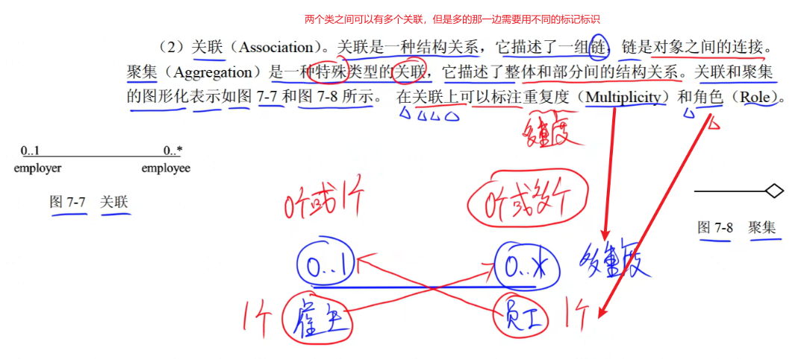

关联的无相边上方为重复度，下边为角色，中间可以是关联名

**关联中的特殊情况聚集**

真题1

真题2

真题3

真题4

真题5

真题6

真题7

真题8

### 6.4关联多重度

关联多重度：**一个类的实例能够对应另外一个类的多个实例，需要两边是多对多的关系**

真题1

真题2

真题3

这题不要钻牛角尖，选相对最对的哪一个

### 4.交互图

#### 4.1、序列图（顺序图）

**多个对象与一个用例的行为**

真题1（可以看看）

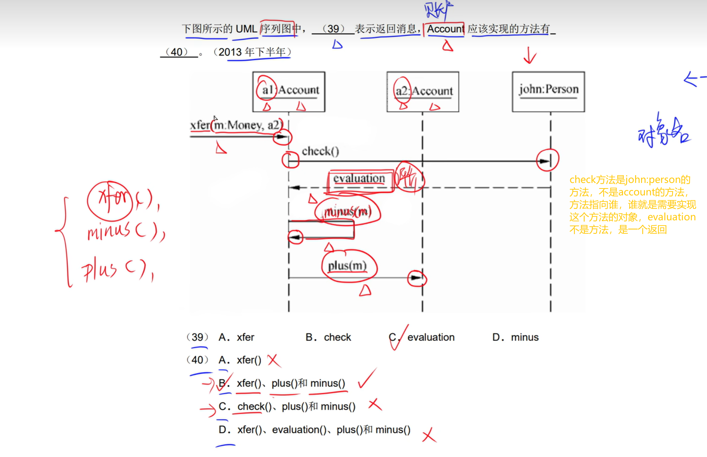

真题2

真题3

#### 4.2、通信图（协作图）

通信图展示了对象之间的消息流及其顺序

真题1

真题2

